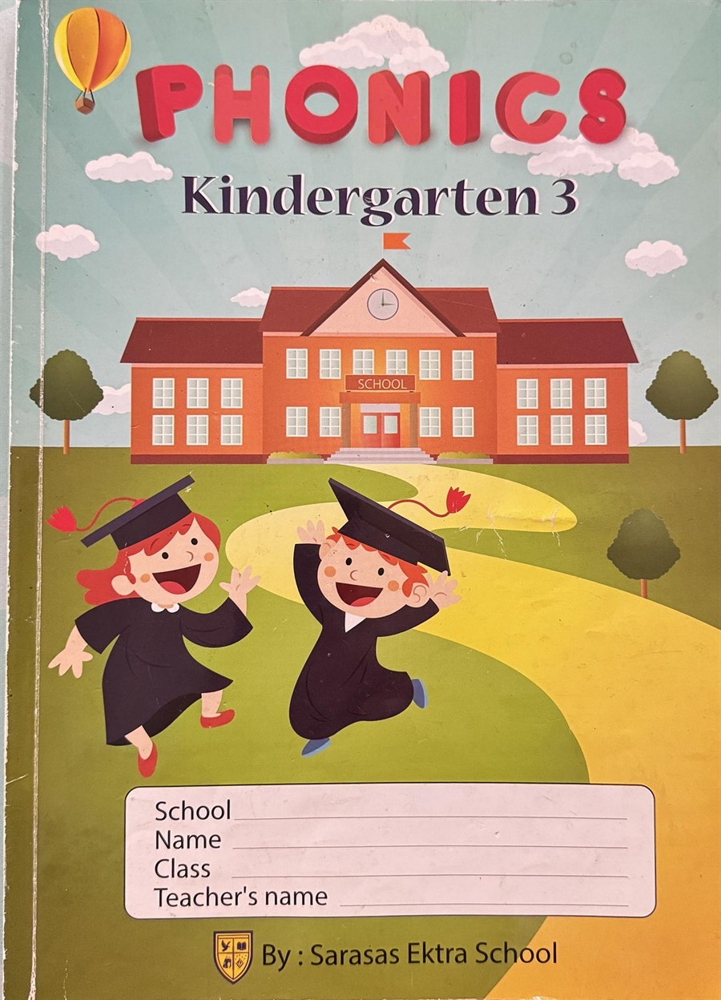

# Blending Builder

A joystick-friendly phonics program for kindergarten ESL learners (age 5–6),
made for Teacher Marc's own joystick — built for young children whose hand and
finger muscles are still developing and who cannot yet use a mouse well.
It runs offline, with no internet needed.

The content follows the **KG3 PHONICS** book, in the same two parts:



Nothing from the book has been left out. Across **46 units** there are
**188 picture words** and **46 stories**, all taken from the book's own
vocabulary and sentences, in the book's order — so a child can practise on the
computer exactly what the class is working on in print.

- **Letters a–z** — all 26 letters plus the digraphs **ch, sh, th** (and **wh**,
  which is not in the book but was kept as an extra). Each story starts with the
  book's tongue-twister — *angry ants at an airport*, *buzzing bees borrowing
  books*, *a crazy cat clawing carpets* … — and uses the vocabulary words from
  that letter's page.
- **Blending sounds** — **ag, am, an, ap, at, ar, ed/eg, en, et, er, in, og, op,
  ot, ub/up, ug**, in the book's order. The stories are built from the book's
  own sentences (*a rag in the bag*, *a cat on a mat*, *a hen in a pen*,
  *a tot in the cot*, *a cub in a tub*, *a bug in the jug* …).

Every unit has its own story, picture-hunt and word-building game.

**There is no narration.** The teacher reads the stories aloud. A computer voice
is available in Teacher Settings but is switched **off** by default.

## How it works

**Home** — two big buttons at the top switch between **Letters a–z** and
**Blending sounds**, each with its own grid. Each unit a child finishes gets a ⭐.
The app remembers which of the two was open last.

A **📘 Guide** button sits in the top bar on the home screen. It opens the
built-in user guide — eleven pages covering what the program takes from the
book, the joystick, each of the activities, Teacher Settings and a suggested
15-minute lesson. Turn the pages
with joystick left/right, exactly like a story. The wording lives in
`index.html` (`<section id="screen-guide">`),
one `<article class="guide-page">` per page, so it can be edited without
touching any code.

Pick a letter and you get three activities, in order:

### 1. Story 📖
A short story written for the teacher to read out loud. One sentence fills the
screen at a time, and the words containing the letter sound are **highlighted in
red** so you know which ones to stress.

**Every page is one whole picture** — a sky, a ground and the characters standing
in it, framed like a storybook page — showing what is happening in that sentence,
so the children can follow the story even before they can read it.

> 👧 🫙 🐜  — *Annie* has a little *ant* farm in a jar.
> 🐜 🍎  — She gives the *ants* a piece of red *apple*.

Every story is **8 pages** of **rhyme** — a rhyming couplet on each page,
shown on two lines so the children hear and see the rhyme, e.g.
*"A fat cat sits on a mat, / she likes to sit there and chat, chat, chat."*
In `alphabet.js` the two lines of a couplet are split with `\n`. On a widescreen
display the picture and the words sit side by side and fill the screen, so the
class can read from the back of the room; on a squarer screen the words go under
the picture.

**🔍 Letter hunt** — press the Letter hunt button under the story. The page shows
the unit's letter (c, sh, ag …) and how many are in the sentence ("Find 4 on this
page — 4 to go"). Every letter on the page becomes a joystick target: the
children drive to each one and press the button. Right ones turn green, wrong
ones just shake, and finding them all gives confetti and a ⭐. For two-letter
sounds (sh, ag, ed/eg) pressing either letter finds the pair. Press **📖 Read**
to go back to normal reading with the words highlighted. The app remembers
which mode you used last.

Joystick left/right turns the page. The last page leads straight into Find.

### 2. Find 👆
Pictures appear and the child picks out the ones with the letter sound in them
(for blending sounds: the ones with that ending, e.g. *bag, tag, rag* for **ag**).
A wrong picture is never secretly right — a picture that also has the sound is
never used as a wrong answer.
A counter shows how many are **still to find**. Wrong picks just shake — nothing
is lost and nobody fails.

### 3. Make 🔤
A picture appears, a row of empty boxes sits under it, and the letters of the word
are jumbled in the tray below. The child **drags the letters into the right order**.

Two ways to do it, whichever suits the child:

- **Drag** — press a letter, drag it up to a box, let go.
- **Pick up and drop** — press the button on a letter to lift it, drive to a box,
  press again to drop it in. No holding the button down, so it works in Arrow Key
  Mode and with dwell select.

For blending sounds the word is built the way the book does it — a start
letter plus the ending (**b + ag**, **c + at**), so the spare tiles are other
endings (*at, og, un …*) and the child has to listen for the right one.

Pressing a letter that is already in a box sends it back to the tray, and dropping
a letter onto a box that is taken simply swaps the two — nothing is ever lost.

When every box is full the app sounds the word out, throws confetti and awards a
star. If the order is wrong, the **correct letters stay where they are** and only
the wrong ones slide back to the tray with a friendly "try again".

### 4. Match 🔗
Four pictures from the letter's book page sit across the top and their words
are jumbled underneath. The child presses a picture, then its word (or a word,
then its picture). A right pair is joined with a green line and the word is
read out; a wrong one just wobbles. Words are not read out before they are
matched, so the child has to read them. All four matched earns a star, then
**Play again** deals a new set of pictures.

### 5. Word 📝, Picture 🖼️ and Sound 👂
Five quick questions each, three answers to choose from:

- **Word** — one big picture; pick its word (*bat · mat · hat*).
- **Picture** — one big word; read it and pick its picture. With the voice on,
  🔊 reads the word for a child who needs help.
- **Sound** — three pictures, only one has the sound ("Which picture starts
  with c?", "Which picture has at in it?"). With the voice on, 🔊 reads the
  question.

A wrong answer wobbles; a right one turns green and the word is read out.

### 6. Memory 🃏
Eight cards face down — four pictures and their four words. Turn two at a
time; a picture and its own word stay up, anything else turns back over.

Each of these games earns a star when finished, then **Play again** deals new
pictures.

Finish all the words for a letter and that letter gets its ⭐ on the home grid.

## Joystick setup

Works with either mode of the Joystick Mouse Controller:

| Joystick mode | What to do |
| --- | --- |
| **Arrow Key Mode** (recommended) | Nothing. Four directions plus the click button drive every screen in the program. |
| **Mouse Mode** | Hover to highlight, click to choose. All targets are large, and anything that can be dragged can also be done with two separate presses instead — there is no double-clicking anywhere. |
| **Mouse Mode + dwell** | Turn on *Dwell select* in Teacher Settings. Resting the cursor on anything for ~1.2 s counts as a click — for children who cannot aim and press at the same time. |

Set a slow Base/Max Speed in the Joystick Controller software for the youngest children.

## Closing the program

On the letters page there is an **✕ Exit** button in the top right. It asks
"Close Blending Builder?" first, with two big buttons — **No, keep playing**
is highlighted by default, so a child who lands on Exit by accident can back
out with the joystick. Escape also backs out.

Exit only shows on the letters page; on every other screen that spot is the
**◀ Back** button.

## Pictures

The pictures are soft **3D cartoons** from Microsoft's free Fluent Emoji set
(MIT licence), kept in the `pics` folder so nothing needs the internet. The few
things that have no 3D picture (rag, dam, cot, quilt, mat, rug, tub …) use the
hand-drawn pictures from `art.js`. `pics3d.js` lists which picture file each
emoji uses. Teacher Settings → **Picture style** switches back to the flat
drawings.

## Teacher settings

Two ways in:

- **Press and hold the ⚙ button** (top right) for **1 second**. A bar fills
  across the bottom of the button while you hold it. A normal quick click does
  nothing — that is deliberate, so a child cannot open it by accident.
- **Press `Ctrl + Shift + S`** — opens it straight away. Easiest if you are
  using the joystick, since the joystick button is made for quick clicks.

| Setting | What it does |
| --- | --- |
| Extra letters in the tray | 0 (easiest — only the right letters) to 3 (hardest) in the Make game |
| Pictures in Find game | 4, 6 or 8 |
| Letter case | lowercase or UPPERCASE |
| Show word under each picture | Labels on the Find pictures, on or off |
| Dwell select + dwell time | Hover-to-click for children who cannot press the button |
| Use the computer voice | Off by default. Turn on if you want the machine to sound out letters and words |
| Voice / speech speed | Uses the voices installed on the Windows machine |
| Reset stars | Clears all stars and letter progress |

Settings and progress are saved on the machine.

## Teacher keys

- `Ctrl + Shift + S` — open Teacher Settings
- `Ctrl + Shift + Q` — quit the app
- `F11` — toggle fullscreen
- `Esc` or `Backspace` — go back a screen

## Running from source

```
npm install
npm start
```

## Building the classroom installer

Do these in order. Numbers below assume version 3.1.1 — substitute whatever is
in `package.json`.

### Step 0 — bump the version (every time you change anything)

Two files must match or the installer will overwrite the wrong thing:

- `package.json` → `"version": "3.1.1"`
- `installer.iss` → `#define MyAppVersion "3.1.1"`

### Step 1 — scramble the code and build the program

```
npm run protect
```

This one command does both jobs. It prints each stage as it goes:

```
  1/4  clearing build-protected
  2/4  copying the program
  3/4  scrambling the code          <-- the scrambling happens here
    scrambled  alphabet.js  (82588 -> 179557 bytes)
    scrambled  app.js       (69946 -> 109554 bytes)
    scrambled  art.js       (106040 -> 337993 bytes)
    ...
  4/4  building
```

Watch for the `3/4 scrambling the code` lines. If you do not see all 7 files
listed there, the build is not protected — stop and check why.

Scrambling makes the stories, word lists and code unreadable to anyone who
opens the installed files. Your own source files are **never** touched, so keep
editing `alphabet.js` and the rest normally. The scrambled copy is a throwaway
in `build-protected\`, which you can delete afterwards.

**Plain build instead:** run `npm run dist` if you want a readable, unscrambled
build — useful when you are testing. The output files are identical in every
other way, so Step 2 does not change.

Either way you get, in `dist\`:

- **Blending Builder Setup 3.1.1.exe** — NSIS installer, per-user, no admin
  rights, creates a desktop shortcut.
- **Blending Builder 3.1.1.exe** — portable. Copy to a USB stick and
  double-click. Nothing is installed. Best for locked-down school machines.
- **win-unpacked\** — the loose program files. Step 2 wraps these up.

### Step 2 — build the classroom installer

```
npm run installer
```

Runs Inno Setup over `dist\win-unpacked` and produces the single file you hand
to teachers:

```
dist\installer\BlendingBuilder-Setup-3.1.1.exe
```

Takes about two minutes — the compression is deliberately set to maximum.

Requires Inno Setup 6 at `C:\Program Files (x86)\Inno Setup 6\`. If you install
it somewhere else, change the `installer` path in `package.json`. You can also
just right-click `installer.iss` and choose **Compile**.

### Step 3 — test before you hand it out

Double-click `dist\installer\BlendingBuilder-Setup-3.1.1.exe` on your own PC.
Check the desktop shortcut appears, the app opens full screen, and
**Ctrl+Shift+Q** exits.

### Which file do I give people?

| File | Give it to |
|---|---|
| `dist\installer\BlendingBuilder-Setup-3.1.1.exe` | Teachers — this is the normal one |
| `dist\Blending Builder 3.1.1.exe` | USB stick, locked-down PCs, nothing installed |

All of them are unsigned, so Windows SmartScreen shows "unrecognised app" the
first time on each PC. Click **More info → Run anyway**. Warn teachers it will
happen so they don't think it is broken.

### If the build fails

- **"cannot access the file because it is being used"** — Blending Builder is
  still running, or an Explorer window is open on `dist\win-unpacked`. Close
  them. `npm run protect` retries this for you automatically.
- **"'C:\Program' is not recognized"** — the Inno Setup path in `package.json`
  lost its quoting. The `installer` script must start with `call`.
- **Installing does not replace the old version** — the version number in
  `installer.iss` does not match `package.json`. See Step 0.

### A warning about uninstalling

`installer.iss` deletes the saved stars and teacher settings on uninstall. A
teacher who uninstalls to "fix" something loses every child's progress.

## Changing the content

Everything a teacher would want to edit lives in **`alphabet.js`**, one block
per letter or blending sound. The order on the home screen is set by
`LETTER_ORDER` and `BLEND_ORDER` at the bottom of that file.

A blending sound has three extra fields:

```js
ag: {
  kind: "blend", letter: "ag", label: "ag", match: ["ag"],
  emoji: "🎒", keyword: "bag",
  ...
  words: [ { word: "bag", emoji: "🎒", parts: ["b", "ag"] } ]
}
```

- `label` — what the tile shows (`"ed eg"` for a unit that teaches two endings)
- `match` — the endings the Find game looks for
- `findPrompt` (optional, any unit) — replaces the instruction in the Find game

A picture name does not have to be an emoji. Things with no emoji (`"rag"`,
`"dam"`, `"cot"`, `"quilt"`, `"wardrobe"` …) use a plain word, which is simply
the name of the drawing in `art.js`.

A letter looks like this:

```js
a: {
  letter: "a", emoji: "🍎", keyword: "apple",
  story: {
    title: "Annie likes Ants",
    lines: [
      "*Annie* has a little *ant* farm in a jar.",
      "She gives the *ants* a piece of red *apple*."
    ],
    scenes: [
      ["👧", "🫙", "🐜"],
      ["🐜", "🍎"]
    ]
  },
  pics: [ { e: "🍎", w: "apple" }, { e: "🐜", w: "ant" } ],
  words: [ { word: "cat", emoji: "🐱", parts: ["c", "a", "t"] } ]
}
```

- `story.lines` — one sentence per line. Put `*asterisks*` round any word you
  want highlighted on screen.
- `story.scenes` — the picture for each page, **one entry per line**. Each entry
  is a short list of emoji that act out the sentence. Keep it to two or three,
  or they get small. If you leave `scenes` out, the letter's own picture is
  shown on every page instead.

  The story pages do **not** show emoji on screen. Each emoji is a *name* for a
  hand-drawn cartoon picture kept in `art.js`, and the app draws that instead.
  Every emoji used anywhere in the app now has a drawing, so the letter grid,
  the letter screen, the Find game and the Make game all show the same
  hand-drawn cartoons as the stories. If you add a new word with an emoji that
  has no drawing yet, the app simply shows the emoji itself, so nothing breaks
  — but it will look out of place next to the cartoons.

  The emoji are the **characters**, not the whole picture. `scene.js` builds the
  scene around them: it picks a setting, paints the sky, ground and scenery, then
  stands each character in it — the first one big and near the front, the rest
  smaller and further back — so the page reads as one illustration.

  The setting is chosen from what is in the list, first match wins:

  | Setting | Triggered by any of |
  | --- | --- |
  | Indoors (room, wooden floor) | 🛏️ 🪑 🪟 🚪 🗄️ 📺 |
  | Desert (sand dunes) | 🏜️ 🌵 |
  | Water (sea and waves) | 🐟 🐳 🐙 🌊 🦆 💦 💧 |
  | Night (dark sky and stars) | 🌙 💤 😴 |
  | Town (rooftops and a path) | 🏠 🏘️ 🏪 🌇 |
  | Field (grass, tree, sun) | anything else — the default |

  So adding 🛏️ to a page moves it indoors, and 🌙 makes it night. Things that
  float — ☀️ 🌙 🌈 🪁 🐦 🐝 ⚡ 🎵 and so on — are put in the sky instead of
  standing on the ground, and if a page is nothing but sky things they are drawn
  large in the middle rather than tucked into the corners.

  To add a drawing, open `art.js` and add an entry to the picture list using the
  emoji as the key. The little helpers at the top of that file (`c` circle,
  `e` ellipse, `r` rectangle, `p` path, `l` line, `txt` text) draw on a 100x100
  square. To change an existing picture, edit its entry — every story page that
  uses it updates at once.
- `pics` — pictures for the Find game. Pictures from other letters are pulled in
  automatically as the wrong answers.
- `words` — the words built in the Make game. `parts` are the graphemes the
  child builds, so digraphs stay together:
  `{ word: "ship", emoji: "🚢", parts: ["sh", "i", "p"] }`.
  Each part becomes one letter tile, so `["sh", "i", "p"]` gives three boxes.

The spare letters that pad out the tray come from `DISTRACTOR_POOL` near the top
of the Make section in `app.js`. Add a new digraph there if you want it to turn
up as a wrong answer.

After editing, rebuild with the steps in **Building the classroom installer**
above, and bump the version in both `package.json` and `installer.iss` so you
can tell the builds apart.
